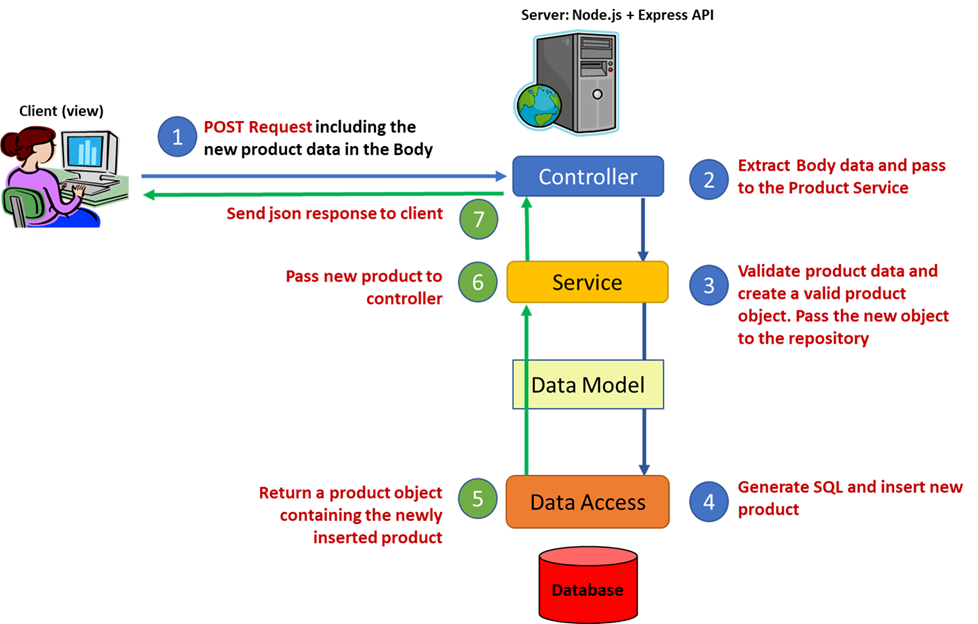
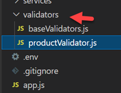
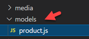
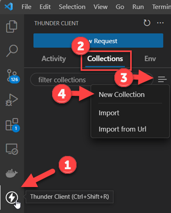
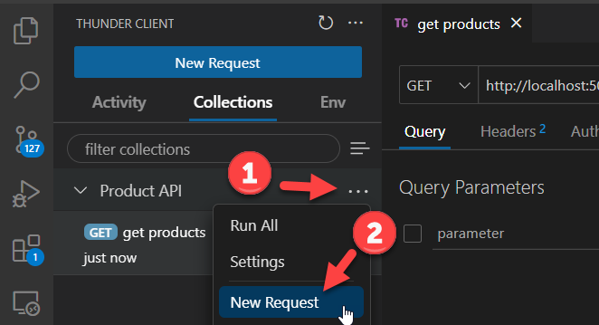
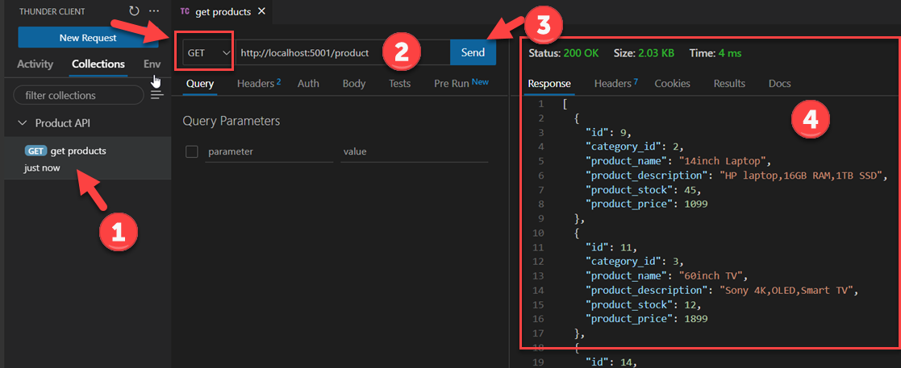
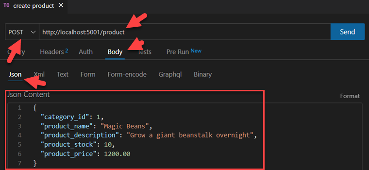
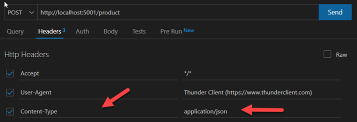
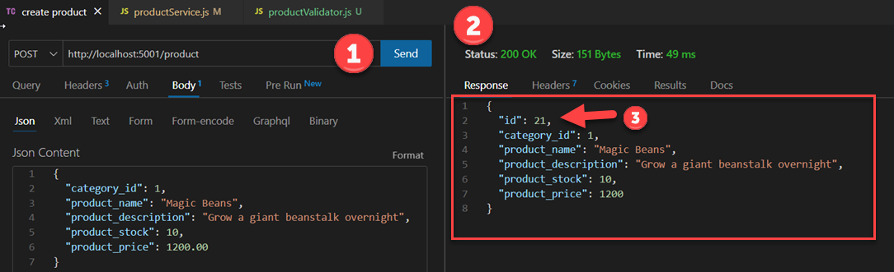
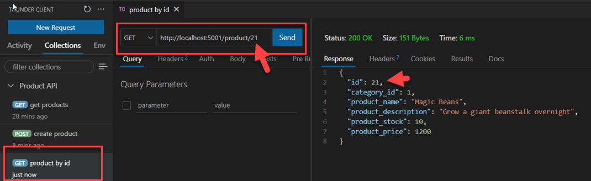

# 8.1 Web API & Database: Create New Products

Enda Lee 2022

### Quick Start

1. Download or `fork` the start site from this repository.
2. Open in VS Code.
2. copy `.env.example` to `.env` and configure for your database.
3. In a terminal run `npm install` and if necessary `npx prisma generate`
4. Start the application using `npm run dev`


## Introduction

In this tutorial you will add new products the Database via an **`HTTP POST`** request to the API. The body of the POST request will include the values for a new product which need to be validated and inserted.

The web API will use SQL commands to accomplish the above but that will be hidden from users of the API who will only see the HTTP interface.




## 1. Inserting new products


### 1.1. The controller endpoint

We need a new endpoint in the **`product controller`** to accept **`POST`** requests to **create/ insert** new products. The product data will be sent as `JSON` in the `request body`. 

```javascript
// This endpoint will return all product data from the database
// Note that this handles a POST request (router.post)
router.post('/', async(req, res) => {

  // read data request body, this will be the new product
  const new_product = req.body;
  
  // If data missing return 400
  if (typeof new_product === "undefined") {
    res.statusMessage = "Bad Request - missing product data";
    res.status(400).json({ content: "Bad Request - missing product data" });
  }
  // log the data to the console
  console.log(`product data sent:\n ${JSON.stringify(new_product)}`);

  // Call productService to create the new product
  try {
    const result = await productService.addNewProduct(new_product);

    // Send response back to client
    res.json(result);

    // Catch and send errors
  } catch (err) {
	  console.log('POST product/ - ', err.message);
      res.sendStatus(500);
  }

});
```


### 1.2. The service

The **`addNewProduct( new_product)`** function will first validate `new_product`. 

```javascript
// This function accepts product data which it validates.
// If validation passes then pass the new product data to the data access layer
async function addNewProduct(product_data) {

  // declare variables
  let result;

    // Call the product validator - kept seperate to avoid clutter here
    let validated_product = productValidator.validateNewProduct(product_data); 

    // If validation returned a product object - save to database
    if (validated_product) {
      // Insert
      result = await productData.createProduct(validated_product);

      return result;
    
    } else {
      return ('invalid product data');
    }
}
```

*Remember to import the new function*

If successful (after validation) it will call the **`createProduct()`** function in `productData.js` to insert it into the database.

#### 1.2.1. Validation

Add a new validator script, `productValidator.js` to the `validators` folder. This will contain functions for validating products.




Copy the following code, which includes the `validateProduct()` function, into **`productValidator.js`**.

*Read the code comments for details*

```javascript
//
// Functions for validating products
//

// for documentation see: https://www.npmjs.com/package/validator
const validator = require('validator');

// Import existing validateId function from baseValidators.
const { validateId } = require('./baseValidators');

// Import product object model
const Product = require('../models/product');

// Validate the body data, sent by the client, for a new product
// product represents the data filled in a form
// It needs to be validated before using in gthe application
function validateNewProduct(product) {
    // Declare constants and variables
    let validated_product;

    // debug to console - if no data
    if (product === null) {
        console.log('validateNewProduct(): Parameter is null');
    }
    // Validate form data for new product fields
    // Creating a product does not need a product id
    // Adding '' to the numeric values makes them strings for validation purposes ()
    // appending + '' to numbers as the validator only works with strings
    if (
        validateId(product.category_id) && 
        !validator.isEmpty(product.product_name) && 
        !validator.isEmpty(product.product_description) && 
        validator.isNumeric(product.product_stock + '', { no_symbols: true, allow_negatives: false }) && 
        validator.isCurrency(product.product_price + '', { no_symbols: true, allow_negatives: false }))
    {
        // Validation passed
        // create a new Product instance based on Product model object
        // no value for product id (passed as null)
        validated_product = new Product(
                0, // New product as no id
                product.category_id,
                // escape is to sanitize - it removes/ encodes any html tags
                validator.escape(product.product_name),
                validator.escape(product.product_description),
                product.product_stock,
                product.product_price
            );
    } else {
        // debug
        console.log("validateNewProduct(): Validation failed");
    }
    // return new validated product object
    return validated_product;
}

// Module exports
// expose these functions
module.exports = {
  validateNewProduct
}
```

*Don't forget to import `productValidator` in `productService.js`*

Also create a new folder named `models` and add a new file, **`product.js`** to the folder. This will define a **`Product`** object for use by the validator.



Add the following code to **`product.js`**

```javascript
// https://developer.mozilla.org/en-US/docs/Web/JavaScript/Guide/Working_with_Objects#Using_a_constructor_function
// https://developer.mozilla.org/en-US/docs/Web/JavaScript/Reference/Functions/default_parameters

function Product(id = 'undefined', cat = 'undefined', name, desc, stock, price) {

    this.id = Number(id);
    this.category_id = Number(cat);
    this.product_name = name;
    this.product_description = desc;
    this.product_stock = Number(stock);
    this.product_price = Number(price);
}

module.exports = Product;
```


### 1.3. Product data

Finally add a data access function to insert the new product into the database.

The following function, **`createProduct()`** goes into **`productData.js`**

```javascript
// Insert a new product into the database
// Return the result
//
async function createProduct(product) {
    let new_product;

    // execute query using prisma.product.create
    // Note the data object
    try {
        // New product so no id
        new_product = await prisma.product.create({
            data: {
                category_id: Number(product.category_id), 
                product_name: product.product_name, 
                product_description: product.product_description, 
                product_stock: Number(product.product_stock), 
                product_price: Number(product.product_price)
            }
        });

    // Catch and log errors to server side console 
    } catch (err) {
        console.log('DB Error - create product: ', err.message);
    } finally {

    }
    // return the new product
    return new_product;
}
```

*Remember to export the new function*

## 2. Testing the API

This is a bit difficult to do in a web browser as headers would need to be modified in developer tools. Instead of that we will use an API testing tool. There are a number of standalone applications which could be used, such as Postman and Insomnia but we will be using a VS Code Extension called [Thunder Client](https://rangav.medium.com/thunder-client-alternative-to-postman-68ee0c9486d6). To install it, click the extensions button in VS Code and search:


### 2.1. Using Thunder Client to test the API

#### 1. Add a new request collection

This will provide a place to save requests used for testing the API.



#### 2. Add a new request to the collection

Select the **Product API** collection, then use the `...`menu to add a **New Request**. Name the request `get products`



####  

 

#### 3. Make a request to get all products.

Open the request just added to the collection. Then use it to make a `GET` request to http://localhost:5001/product and press **SEND**. You should see the server response and other information in the right pane.



###  

### 2.2. Using Thunder Client to send a POST request:

#### First add a new request to the collection named create product

set the request method to **POST** and the body data type to **JSON**:

Then add the endpoint as some **JSON data** in the request body

*Note there is no* `id`



#### Check that the request Content-Type header is set correctly.



 

#### Send the request.

If all goes well the request will send and the response will display the data inserted. Note the details returned which should include the new `product id`. Also check the HTTP status



#### Verify that the data was inserted.

Make a request to get all products via Thunder Client (a browser will also work).



 


## Exercises

Add functionality for the following:

**1.**   **Update a Product.**

This is very similar to insert/ POST but uses a HTTP PUT request. also sends the existing Product id (in addition to the data sent for insert) of the product to be updated, in the request body. Add the function and test with Thunder Client.

**2.**  **Deleting a Product.**

This is very similar to getting a single product but uses the HTTP DELETE method instead of GET. Add the function and test with Thunder Client.

**3.**   **Use Thunder Client to test the new endpoints.**

See the **[Prisma CRUD Reference](https://www.prisma.io/docs/concepts/components/prisma-client/crud)** for examples of how to update and delete: **https://www.prisma.io/docs/concepts/components/prisma-client/crud**


------

Enda Lee 2022
